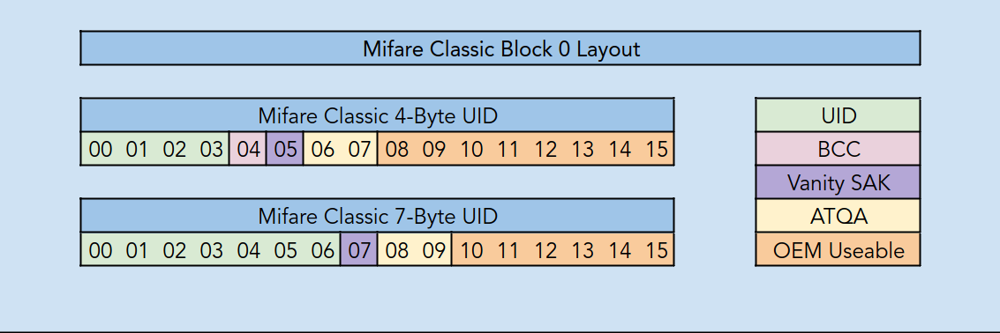

# MFOC-Hardnested (with Cross-Card-Size Copy Support)

**MFOC** is an open-source implementation of the “offline nested” attack on MIFARE Classic cards, originally developed by **Nethemba**. It was later extended to include the powerful **hardnested** attack, designed by **Carlo Meijer** and **Roel Verdult**.

this project includes a complete **Win32 x64 port** using native Windows tools and builds with **Visual Studio 2019** and the **LLVM `clang-cl`** toolchain. GNU toolchain support is maintained using `autotools` + `gcc` (as in the original project).

This fork by **Amine Mahdane** introduces **support for copying across different MIFARE Classic card sizes**, such as:

* 1K → 4K
* 320B (Mini) → 1K or 4K

---

## ⚠️ Disclaimer

MFOC can **only recover keys** from a MIFARE Classic tag **if at least one sector uses a known key**:

* A **default key** (already built into MFOC), or
* A **custom key** provided by the user via command-line.

---

## 🔧 Features

* Hardnested attack support
* Cross-size cloning support (Mini to 1K/4K, 1K to 4K)
* Compatible with `nfc-mfclassic` for writing `.mfd` dumps
* Includes precompiled dependencies for Windows build

---

## 📦 Dependencies

* [`libnfc`](https://github.com/nfc-tools/libnfc/)
* [`libusb-win32`](https://sourceforge.net/projects/libusb-win32/files/libusb-win32-releases/1.2.6.0/)
* [`pthreads4w`](https://sourceforge.net/projects/pthreads4w/)
* [`liblzma`](https://tukaani.org/xz/)

> **Note:** `pthreads4w` and `liblzma` are statically linked. All required libraries are precompiled and included in `src\lib`.

---

## 🛠️ Build Instructions

### Windows

1. Install **Visual Studio 2019** with the following components:

   * Desktop Development with C++
   * C++ Clang Compiler for Windows
   * C++ Clang-cl for v142 Build Tools

2. Open the solution in Visual Studio.

3. Build the solution. The compiled zip package will appear in the `dist` folder.

---

### Linux

```sh
autoreconf -vis
./configure
make && sudo make install
```

---

## 🚀 Usage Guide

### Windows Setup

1. Ensure `libusb0.dll` and `nfc.dll` are in the same directory as the executable (or in your system PATH).

2. Install **libusbK v3.0.7.0** using [Zadig](https://zadig.akeo.ie/):

   * Go to **Options > List All Devices**
   * Select your NFC reader
   * Choose **libusbK (v3.0.7.0)** as the driver
   * Click **Replace Driver**

3. In **Device Manager**, disable the **power-saving option**:

   * Go to your reader under **libusbK USB Devices**
   * Right-click → Properties → Power Management
   * Uncheck "Allow the computer to turn off this device to save power"

---

### Reading a Card

1. Place the MIFARE Classic card on the reader.
2. Run:

```sh
mfoc-hardnested -h
```

To perform a full dump:

```sh
mfoc-hardnested -O mycard.mfd -k keys.txt -P 500 -T 5
```

---

### Writing to a New Card

#### ✅ If the card sizes are the same:

```sh
nfc-mfclassic W a mycard.mfd
```

#### ⚠️ If writing to a larger card (e.g., 320B → 1K):

You **must pad** the dump to match the size of the target card. Follow these steps:

1. Open the provided `padding.py` script.
2. Replace the block list with your copied data from the terminal output.
3. Run the script to generate a padded `.mfd` file:

```sh
python padding.py
```

This creates `mycard_1k.mfd`.

4. Write it to the new blank card:

```sh
nfc-mfclassic W a mycard_1k.mfd
```

---

## writing to Gen1 cards (SAK modification)

| Term       | Meaning                                                                                                                     |
| ---------- | --------------------------------------------------------------------------------------------------------------------------- |
| WUP-SAK    | SAK Value found during the Wake up & Anti-collision process, what you would see reported from a basic search.               |
| Vanity SAK | SAK Value represented in Block 0 of a Mifare Classic, on legitimate cards this does not inform the value of the WUP-SAK.    |
| Magic Card | An illegitimate card capable of changing it's UID; some magic cards are also able to change other values such as ATQA/SAK. |




### What is SAK Swapping? 
SAK Swapping is the name given to behaviour that has been observed in [Mifare Classic](https://www.nxp.com/products/rfid-nfc/mifare-hf/mifare-classic:MC_41863) cards where their Vanity SAK is not the same as their WUP-SAK as observed in other Mifare Classic chips where the Vanity SAK is identical to the WUP-SAK. 

The correct WUP-SAK for a Mifare Classic 1K is `0x08` and `0x18` for 4K, but when having it's memory dumped, the Vanity SAK shows `0x88` and `0x98` respectively, we believe this to be a means of clone detection as various magic cards mirror their WUP-SAK from the Vanity SAK and if that WUP-SAK is not correct for the chip it's coming from, the system knows it is a cloned card & rejects it. 

### The Double Cross 
"The Double Cross" is a name given to an extra step that has been observed in many systems where not only will they do SAK Swapping but then also send a read command to block 0 in order to validate that the WUP-SAK and Vanity SAK are different values, preventing the use of a magic card that mirrors it's WUP-SAK from the Vanity SAK. 

### Solution 
The solution to SAK swapping by itself is to change the Vanity SAK in block 0 to reflect the correct WUP-SAK for your card. This will only work if your system isn't Double Crossing!

If the system is Double Crossing then you will need the WUP-SAK and Vanity SAK to be different, you will need a magic card or emulator that does not mirror the WUP-SAK from the Vanity SAK in block 0, but instead either enforces the correct WUP-SAK regardless of the Vanity SAK, or allows you to specify the value for the WUP-SAK indepedent of the Vanity SAK. This can't be done with Gen1 cards !


### Magic Cards

| Gen       | Note                                                                              | Circumvents double crossing? |
| --------- | --------------------------------------------------------------------------------- | ---------------------------- |
| Gen1a     | Largely observed to mirror WUP-SAK from Vanity SAK                                | :x:                          |
| Gen2 CUID | Largely observed to enforce correct SAK regardless of Vanity SAK.                 | :ballot_box_with_check:      |
| Gen4 UMC  | Allows you to manually control the value of the WUP-SAK regardless of Vanity SAK. | :ballot_box_with_check:      |
| Gen4 GDM  | Allows you to manually control the value of the WUP-SAK regardless of Vanity SAK. | :ballot_box_with_check:      |

Magic card gens all have sub-variants so YMMV if the above applies to the card you have in front of you, these are just broad strokes observations on what to use in a given situation. 

### Fixing Vanity SAK in a Dump

1. Open your dump in a hex editor:

   ```sh
   hexedit goodcard.mfd
   ```

2. Find the SAK in block 0
   * For 1K cards → set to `08`
   * For 4K cards → set to `18`

4. Write the fixed dump back:

   ```sh
   nfc-mfclassic W a card.mfd
   ```

After this, `nfc-list` should report **SAK = 08** for 1K and **SAK = 18** for 4K cards.

## Resources 
- [Mifare Classic 1/4k](https://www.nxp.com/products/rfid-nfc/mifare-hf/mifare-classic/mifare-classic-ev1-1k-4k:MF1S50YYX_V1)
- [Mifare type identification procedure](https://www.nxp.com/docs/en/application-note/AN10833.pdf)
- [Proxmark Repo Magic card notes](https://github.com/RfidResearchGroup/proxmark3/blob/master/doc/magic_cards_notes.md)

## 🙏 Credits

This project is based on work by many contributors. Please see the `AUTHORS` file for full attribution.

Special thanks to:

* **vk496** for integrating `mylazycracker` into MFOC
* **Nethemba**, **Carlo Meijer**, and **Roel Verdult** for their foundational work
